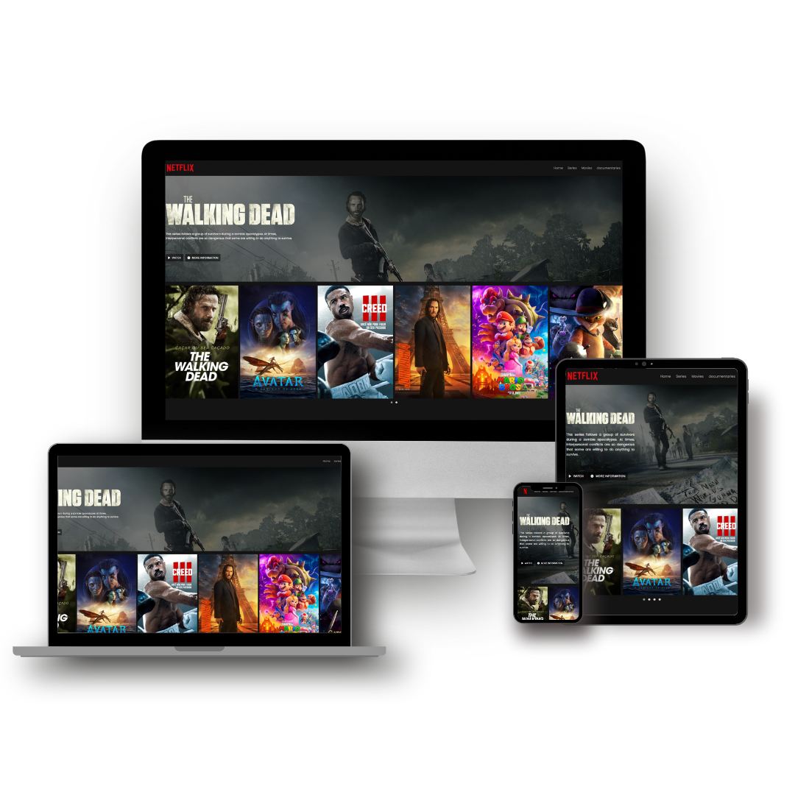

# netflix-clone

 

  <a href="#house-About-the-project">About</a>&nbsp;&nbsp;&nbsp;|&nbsp;&nbsp;&nbsp;
  <a href="#computer-Technologies">Technologies</a>&nbsp;&nbsp;&nbsp;|&nbsp;&nbsp;&nbsp;

 

## :house: About the project

This is a project of a clone of the Netflix homepage. It was created as an exercise to practice HTML, CSS, and JavaScript.
  
Este é um projeto de clone da página inicial do Netflix. Ele foi criado como um exercício para praticar HTML, CSS e JavaScript.

  

## :computer: Technologies 

  

  

  

  

